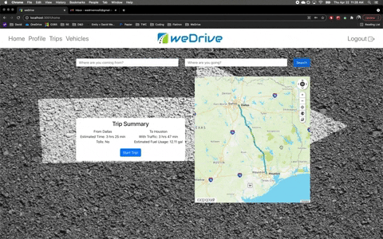
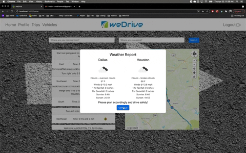
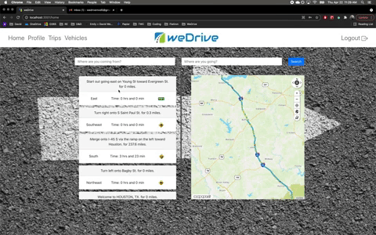

# README

---
## weDrive - Backend

weDrive is a journey management application that aims to reduce the risks associated with driving by providing the user with the information necessary to make smart driving decisions before they get in their car.

---
## Motivation

Driving is the most dangerous thing most people do on a daily basis but it's also something we take for granted and don't pay it the respect it deserves. weDrive was created to help encourage users to really think about the factors that impact their safety before they get in the car so they can plan accordingly and hopefully reduce the risk of an accident.

--- 
## Technology

* Frontend - React
* State Management - Redux
* Backend - Ruby on Rails
* MapQuest.js SKD
* OpenWeather API
* Styling - React Bootstrap

---
## Features

* OpenWeather API pulls current weather forecast for origin and destination of trip
* MapQuest map API utilized for step-by-step routing as well as real time traffic
* ActionMailer used to send notifications to Emergency Contacts
* JSON web tokens for authentication
* Bcrypt for password hashing on backend

---
## Demo

Full Demo: https://youtu.be/9KVhCc_vHVg

Starting a Trip:

Weather and Vehicle Inspection:

Routing and Emergency Contact Notification: 

This README would normally document whatever steps are necessary to get the
application up and running.

Things you may want to cover:

* Ruby version

* System dependencies

* Configuration

* Database creation

* Database initialization   

* How to run the test suite

* Services (job queues, cache servers, search engines, etc.)

* Deployment instructions

* ...
